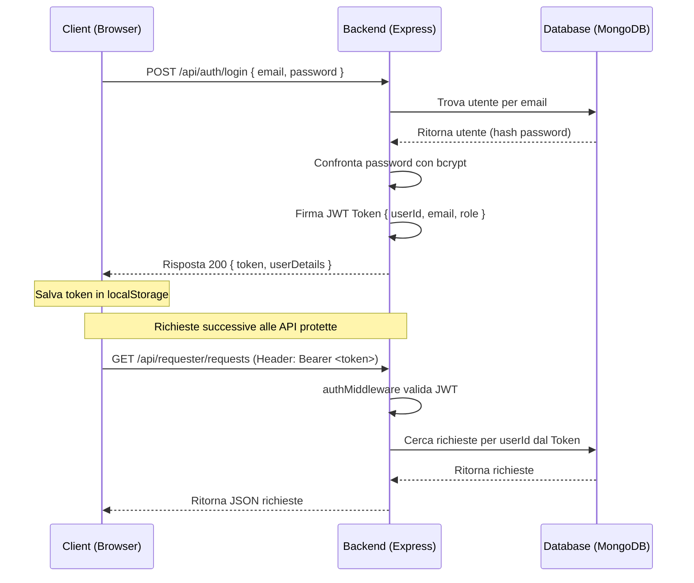

# TridentumCare — Sistema di Autenticazione e Sessioni JWT

Abbiamo implementato un sistema di autenticazione e gestione delle sessioni **reale, sicuro e conforme agli standard di settore**, rimuovendo completamente i vecchi bypass demo fittizi.

---

## 🛠️ Cosa è stato fatto

1. **Gestione Sicura delle Password**:
   - Installato `bcryptjs` nel backend per cifrare e verificare le password.
   - Le password non vengono mai salvate in chiaro nel database.

2. **Sessioni con Token JWT (JSON Web Tokens)**:
   - Installato `jsonwebtoken` per emettere token di sessione cifrati con durata di **24 ore**.
   - Creato un middleware di autenticazione auth.js che intercetta le richieste API, convalida il token presente nell'header HTTP `Authorization: Bearer <token>` ed estrae i dati dell'utente (`userId`, `email`, `role`).

3. **Integrazione del Database e Seeding dei Test Users**:
   - Aggiornato lo script di seeding seed.js per inserire nel DB due utenti di test con password cifrata:
     - **Volontario**: `mario.rossi@email.it` (Password: `password123`)
     - **Richiedente**: `angela.bianchi@email.it` (Password: `password123`)
   - Collegato correttamente le richieste fittizie nel DB all'ID reale dell'utente di test Angela Bianchi, allineando tutti gli stati delle richieste tra le varie bacheche.

4. **Sicurezza degli Endpoint API**:
   - **Richiedente** (requester.js): Ora estrae l'ID utente (`userId`) direttamente dal token JWT decodificato e verifica i permessi di ruolo (`requester`), impedendo ad utenti esterni di leggere, modificare o eliminare richieste altrui.
   - **Volontario** (volunteer.js): Ora estrae l'ID utente (`userId`) direttamente dal token JWT decodificato, cercando il profilo per `ObjectId` e garantendo totale isolamento delle sessioni e coerenza di dati.

5. **Integrazione Frontend Completa**:
   - Aggiornato main.js per implementare un helper di chiamata di rete `authorizedFetch` che inserisce automaticamente l'header `Authorization: Bearer <token>` in tutte le richieste verso il backend.
   - Creato il ripristino automatico di sessione: all'avvio dell'applicazione, se è presente un token nel `localStorage`, viene interrogata l'API `/api/auth/me` per ricaricare istantaneamente il profilo utente e reindirizzarlo al rispettivo pannello senza richiedere nuovamente l'accesso.

---

## 🔑 Credenziali Utenti di Test

| Ruolo | Email | Password | Stato nel Database |
| :--- | :--- | :--- | :--- |
| **Volontario** | `mario.rossi@email.it` | `password123` | Registrato con 1250 Punti e 3 competenze (Trasporto, Accompagnamento, Compagnia) |
| **Richiedente** | `angela.bianchi@email.it` | `password123` | Registrata con 3 Richieste in besa di volontariato precaricate |

---

## 🔄 Flusso di Lavoro del Token di Sessione

---