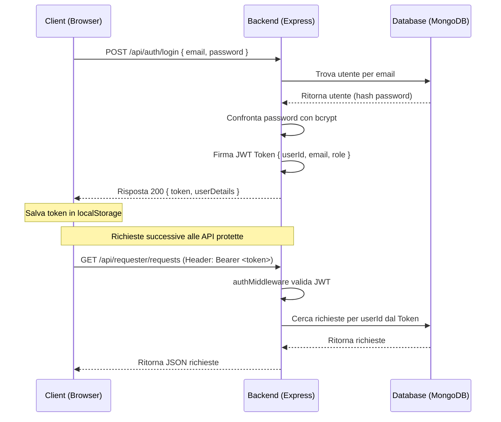

# TridentumCare — Sistema di Autenticazione e Sessioni JWT

Abbiamo implementato un sistema di autenticazione e gestione delle sessioni **reale, sicuro e conforme agli standard di settore**, rimuovendo completamente i vecchi bypass demo fittizi.

---

## 🛠️ Cosa è stato fatto

1. **Gestione Sicura delle Password**:
   - Installato `bcryptjs` nel backend per cifrare e verificare le password.
   - Le password non vengono mai salvate in chiaro nel database.

2. **Sessioni con Token JWT (JSON Web Tokens)**:
   - Installato `jsonwebtoken` per emettere token di sessione cifrati con durata di **24 ore**.
   - Creato un middleware di autenticazione auth.js che intercetta le richieste API, convalida il token presente nell'header HTTP `Authorization: Bearer <token>` ed estrae i dati dell'utente (`userId`, `email`, `role`).

3. **Integrazione del Database e Seeding dei Test Users**:
   - Aggiornato lo script di seeding seed.js per inserire nel DB 5 utenti di test completi (Admin, Moderator, Volunteer, Requester, Partner)
   - Collegato correttamente le richieste fittizie nel DB all'ID reale dell'utente di test Riccardo Rossi, allineando tutti gli stati delle richieste tra le varie bacheche.

4. **Sicurezza degli Endpoint API**:
   - **Richiedente** (requester.js): Ora estrae l'ID utente (`userId`) direttamente dal token JWT decodificato e verifica i permessi di ruolo (`requester`), impedendo ad utenti esterni di leggere, modificare o eliminare richieste altrui.
   - **Volontario** (volunteer.js): Ora estrae l'ID utente (`userId`) direttamente dal token JWT decodificato, cercando il profilo per `ObjectId` e garantendo totale isolamento delle sessioni e coerenza di dati.
   - **Amministrativo** (administrative.js): Le rotte sono protette non solo dal JWT, ma anche dal controllo del livello di autorizzazione gerarchico (`authLvl`) per differenziare le operazioni permesse ad Amministratori rispetto a Moderatori.

5. **Integrazione Frontend Completa**:
   - Aggiornato main.js per implementare un helper di chiamata di rete `authorizedFetch` che inserisce automaticamente l'header `Authorization: Bearer <token>` in tutte le richieste verso il backend.
   - Creato il ripristino automatico di sessione: all'avvio dell'applicazione, se è presente un token nel `localStorage`, viene interrogata l'API `/api/auth/me` per ricaricare istantaneamente il profilo utente e reindirizzarlo al rispettivo pannello senza richiedere nuovamente l'accesso.

6. **Sistema Avanzato di Moderazione e Gestione Utenti**:
   - **Sospensioni Progressive (Ban System)**: Il sistema conta automaticamente i ban (12h, 1gg, 1sett, 1mese) ed espelle forzatamente l'utente bloccandogli il login finché la data `suspendedUntil` non scade. L'Admin/Moderatore vede lo stato in tempo reale.
   - **Cancellazione Dati a Cascata (Cascade Deletion)**: Eliminando un utente (solo gli Admin possono farlo), il database esegue pulizie intelligenti per non lasciare dati orfani (se si elimina un richiedente, spariscono le sue richieste; se si elimina un volontario, le sue richieste vengono liberate e rimesse 'In Attesa di Volontario').
   - **Generazione e Reset Credenziali Partner**: Gli account Partner vengono creati senza password iniziale dall'utente, è il sistema (Admin) a generare password crittografate randomiche e copiarle nella clipboard dell'amministratore.

---

## 🔑 Credenziali Utenti di Test

| Ruolo | Email | Password | Stato nel Database |
| :--- | :--- | :--- | :--- |
| **Amministratore (Admin)** | `admin@email.it` | `TridentumCare23!` | Accesso totale. Può gestire ruoli, utenti, richieste e generare password partner |
| **Moderatore (Massimo Modena)** | `massimo.modena@email.it` | `TridentumCare23!` | Può bannare utenti e moderare richieste. Niente privilegi amministrativi su permessi o eliminazioni |
| **Volontario (Valerio Volpi)** | `valerio.volpi@email.it` | `TridentumCare23!` | Registrato con 1250 Punti e 3 competenze (Trasporto, Accompagnamento, Compagnia) |
| **Richiedente (Riccardo Rossi)** | `riccardo.rossi@email.it` | `TridentumCare23!` | Registrato con 2 Richieste in bacheca precaricate |
| **Partner (Farmacia Centrale)** | `farmacia.centrale@email.it` | `TridentumCare23!` | Account commerciale per creare premi e visualizzare i coupon riscattati |

---

## 🔄 Flusso di Lavoro del Token di Sessione

---